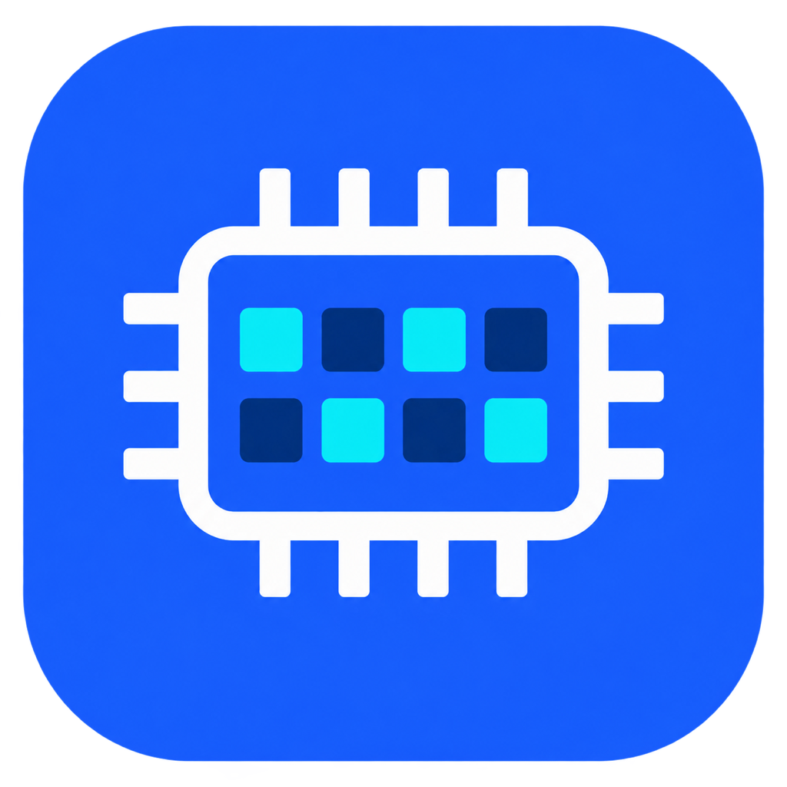
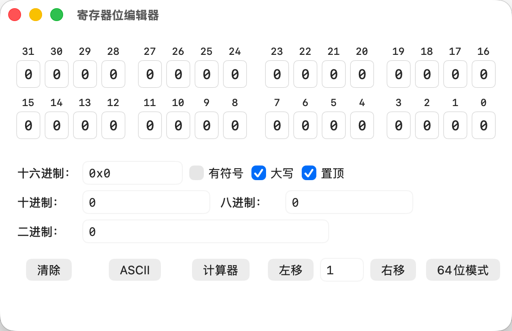

<div align="center">
  
  <h1>RegisterBitEditor / 寄存器位编辑器</h1>
  <p>一款紧凑的原生 macOS 寄存器位编辑与进制转换工具。<br>A compact native macOS register bit editor and radix conversion utility.</p>
  <p><strong>Version 0.1 (14) · Apple Silicon · macOS 13+</strong></p>
  <p><a href="#中文">中文</a> · <a href="#english">English</a></p>
</div>

---

## 主界面预览 / Interface Preview

<div align="center">
  
</div>

---

## 中文

### 简介

RegisterBitEditor 是一个使用 SwiftUI 编写的原生 macOS 调试工具，适合芯片寄存器配置、位掩码计算和数值格式转换。它默认使用紧凑的 32 位界面，也可以快速切换到 64 位模式。

### 功能

- 32 位和 64 位寄存器模式
- 点击任意 bit 直接翻转 0/1
- 每 4 bit 为一个半字节小组，每 8 bit 为一个字节大组
- Hex、Dec、Oct、Bin 实时同步输入与显示
- 支持 `0x`、`0b`、`0o` 输入前缀
- 数值采用紧凑显示，不补多余前导零
- 支持 32/64 位有符号十进制显示
- AND、OR、XOR、NOT 位运算
- 左移、右移和一键清零
- 十六进制大小写切换
- 点击进制标签复制对应数值
- 完整 ASCII 0–127 码表和当前寄存器字节解释
- 一键打开 macOS 系统计算器
- 默认窗口置顶，可随时关闭
- 32/64 位切换时自动调整窗口大小

### 系统要求

- Apple Silicon Mac（arm64）
- macOS 13 或更高版本
- 从源码构建需要完整安装 Xcode；当前版本使用 Xcode 26 验证

### 直接运行

请从本仓库的 **Releases** 页面下载 `RegisterBitEditor-macOS.zip`，解压后打开 `RegisterBitEditor.app`。应用安装包只发布在 Releases 中，不放入源码仓库。

应用目前使用 ad-hoc 临时签名，没有经过 Apple 公证。首次打开时，如果 macOS 显示安全提示，请右键应用并选择“打开”，或在“系统设置 → 隐私与安全性”中允许。

### 从源码构建

双击 `RegisterBitEditor.xcodeproj`，在 Xcode 中选择 **My Mac**，然后运行或构建。

也可以使用命令行：

```sh
git clone https://github.com/tangruu/registerdump.git
cd registerdump

DEVELOPER_DIR=/Applications/Xcode.app/Contents/Developer \
  /Applications/Xcode.app/Contents/Developer/usr/bin/xcodebuild \
  -project RegisterBitEditor.xcodeproj \
  -scheme RegisterBitEditor \
  -configuration Release \
  -destination 'platform=macOS,arch=arm64' \
  -derivedDataPath /private/tmp/RegisterBitEditorDerivedData \
  CODE_SIGNING_ALLOWED=NO build
```

构建产物位于：

```text
/private/tmp/RegisterBitEditorDerivedData/Build/Products/Release/RegisterBitEditor.app
```

### 使用说明

1. 点击 bit 按钮修改寄存器值。
2. 在 Hex、Dec、Oct 或 Bin 输入框中输入数值，其他格式会实时更新。
3. 使用底部“64位模式”按钮切换位宽。
4. 使用“有符号”和“大写”选项改变显示方式。
5. AND、OR、XOR、NOT 位运算位于菜单栏的“位运算”菜单。
6. 点击 Hex、Dec、Oct 或 Bin 标签即可复制对应数值。

### 项目结构

```text
RegisterBitEditor.xcodeproj/        Xcode 工程
RegisterBitEditor/                  SwiftUI 源码与资源
  ContentView.swift                 主界面与布局
  RegisterViewModel.swift           状态、交互和系统功能
  RegisterCore.swift                解析、格式化与位运算核心
  WindowLevelController.swift       窗口置顶与动态尺寸
  Assets.xcassets/                  AppIcon 和颜色资源
  Design/AppIcon-1024.png           图标主图
Tests/CoreSelfTest.swift            核心逻辑自测
HANDOFF.md                          维护、构建和交接说明
```

后续开发和发布流程请参阅 [`HANDOFF.md`](HANDOFF.md)。

---

## English

### Overview

RegisterBitEditor is a native macOS debugging utility built with SwiftUI. It is designed for chip register configuration, bit-mask calculations, and radix conversion. The app opens in a compact 32-bit layout and can switch to a 64-bit layout when needed.

### Features

- 32-bit and 64-bit register modes
- Click any bit to toggle its value
- Visual grouping by nibble (4 bits) and byte (8 bits)
- Synchronized Hex, Dec, Oct, and Bin input and display
- Input prefixes: `0x`, `0b`, and `0o`
- Compact number formatting without unnecessary leading zeros
- Signed decimal display for 32-bit and 64-bit values
- AND, OR, XOR, and NOT operations
- Left shift, right shift, and clear
- Uppercase or lowercase hexadecimal output
- Click a radix label to copy its value
- Complete ASCII 0–127 table with current-register byte interpretation
- Open the built-in macOS Calculator
- Always-on-top window enabled by default
- Automatic window resizing when switching register width

### Requirements

- Apple Silicon Mac (arm64)
- macOS 13 or later
- A full Xcode installation is required to build from source; the current release was verified with Xcode 26

### Run the App

Download `RegisterBitEditor-macOS.zip` from this repository's **Releases** page, extract it, and open `RegisterBitEditor.app`. Application builds are published only through Releases and are not stored in the source repository.

The bundled app uses an ad-hoc signature and is not notarized by Apple. On first launch, you may need to right-click the app and choose **Open**, or allow it under **System Settings → Privacy & Security**.

### Build from Source

Open `RegisterBitEditor.xcodeproj` in Xcode, select **My Mac**, then run or build the app.

Command-line build:

```sh
git clone https://github.com/tangruu/registerdump.git
cd registerdump

DEVELOPER_DIR=/Applications/Xcode.app/Contents/Developer \
  /Applications/Xcode.app/Contents/Developer/usr/bin/xcodebuild \
  -project RegisterBitEditor.xcodeproj \
  -scheme RegisterBitEditor \
  -configuration Release \
  -destination 'platform=macOS,arch=arm64' \
  -derivedDataPath /private/tmp/RegisterBitEditorDerivedData \
  CODE_SIGNING_ALLOWED=NO build
```

Build output:

```text
/private/tmp/RegisterBitEditorDerivedData/Build/Products/Release/RegisterBitEditor.app
```

### Usage

1. Click a bit button to change the register value.
2. Enter a value in the Hex, Dec, Oct, or Bin field; the other formats update immediately.
3. Use the **64-bit Mode** button at the bottom to change register width.
4. Use the signed and uppercase options to change number formatting.
5. AND, OR, XOR, and NOT are available from the **Bitwise Operations** menu.
6. Click a Hex, Dec, Oct, or Bin label to copy its value.

### Project Layout

```text
RegisterBitEditor.xcodeproj/        Xcode project
RegisterBitEditor/                  SwiftUI source and assets
  ContentView.swift                 Main interface and layout
  RegisterViewModel.swift           State, interactions, and system actions
  RegisterCore.swift                Parsing, formatting, and bitwise core
  WindowLevelController.swift       Always-on-top and dynamic window sizing
  Assets.xcassets/                  App icon and color assets
  Design/AppIcon-1024.png           Icon master image
Tests/CoreSelfTest.swift            Core logic self-test
HANDOFF.md                          Maintenance and release handoff
```

See [`HANDOFF.md`](HANDOFF.md) for maintenance, build, validation, and release details.
